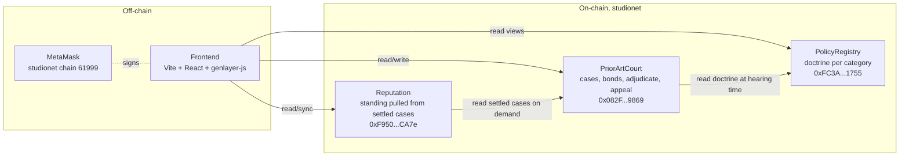
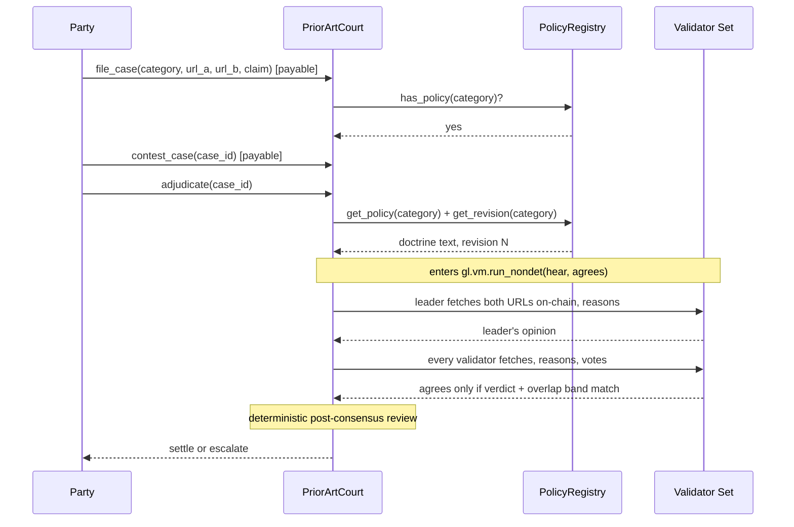
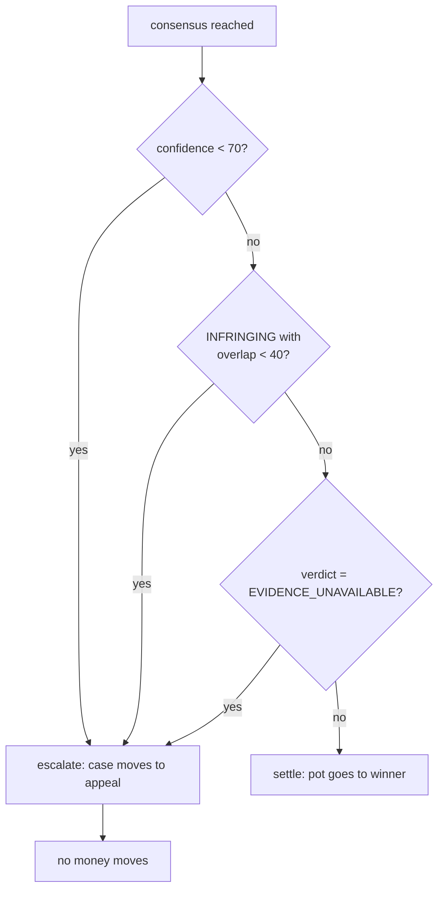

# Architecture

Prior Art Court is three Intelligent Contracts on GenLayer studionet plus a
Vite + React frontend that talks to them through `genlayer-js`. Everything
below is what actually runs; there are no plan-only diagrams in this file.

## Three contracts, one court



Two properties are load-bearing:

1. **Nothing writes across contracts.** The court reads the registry
   synchronously (both land in the same transaction). The reputation
   contract *pulls* from the court through its public views; the court
   never knows reputation exists. A cross-contract write is dispatched as
   a message after finalization, which would leave settlement half-applied
   if the message ever failed. That failure mode is designed out.
2. **The doctrine layer is the whole integration surface.** Bringing a new
   kind of work under the court's jurisdiction (patents, photography,
   recipes, moderation policies) requires no code change to the court,
   just a paragraph registered on `PolicyRegistry`.

## The two intelligent instances



Two consensus rounds are possible: the first instance (`adjudicate`), and
the appeal instance (`appeal`), which reads a third source and answers a
question the first instance never asked, precedence.

## What the validator function accepts

```python
# contracts/contract.py, first instance
def agrees(leader_result) -> bool:
    theirs = json.loads(leader_result.calldata)
    mine   = json.loads(hear())
    if theirs["verdict"] != mine["verdict"]:
        return False
    return abs(theirs["overlap_pct"] - mine["overlap_pct"]) <= 25
```

The wording differs freely, the estimate differs within a band, but the
finding must match exactly. Two validators who disagree about whether
`B` copied `A` cannot pass consensus by writing similarly-shaped JSON.

## Post-consensus safety nets



If the appeal itself still cannot read the evidence, every stake is
refunded to whoever put it up. A court that cannot see the evidence has no
business redistributing money over it.

## Frontend layout

- `frontend/src/lib/chain.ts` builds the `genlayer-js` client, adds or
  switches to studionet on wallet connect, and polls transactions with a
  timeout the UI can render around.
- `frontend/src/lib/court.ts` is the domain layer. It only knows about
  cases, doctrine, bonds, and standings. No React.
- `frontend/src/components/` holds the court dApp panels (docket, case
  view, file complaint, consensus overlay, doctrine library, standings).
- `frontend/src/sections/` holds the marketing sections (hero, problem,
  lifecycle, signals, consensus, verdicts, architecture, use-cases,
  compare, walkthrough, faq, site nav, footer).
- `App.tsx` composes the two.

## What the tests do

- **Fast lane** (`pytest`, default): 73+ offline cases against
  `gltest.direct`, a Python VM. Every scenario the live network cannot
  reproduce cheaply lives here: mocked LLM output, injected fetch
  failures, two validators contradicting each other, thin evidence,
  double-adjudicate, appeal-of-decided, and every negative input the
  contract must refuse.
- **Slow lane** (`pytest -m slow --network studionet`): live-network
  smoke tests. Prove the deployed schema is still reachable and every
  doctrine is still registered. Meant as a regression net after
  redeploys, not as a substitute for the fast suite.
